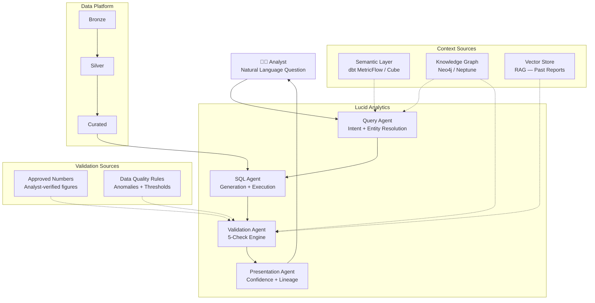

# Lucid Analytics — Architectural Reasoning

*Living whitepaper. Last updated: April 2026.*

---

## Why This Architecture Exists

The data engineering world spent a decade building better pipelines. We got the Medallion Architecture: Bronze for raw ingestion, Silver for cleaned and conformed data, Gold for curated, business-ready models. It worked.

Then LLMs arrived. The BI layer — dashboards, cubes, semantic models — started looking replaceable. "Just ask the AI" became a credible pitch.

Two things happened simultaneously:
1. Vendors scrambled to ship text-to-SQL on top of semantic layers
2. Everyone discovered that LLM-generated SQL answers are often **plausible but wrong**

The problem is not SQL generation quality. That's mostly solved (Snowflake Cortex Analyst claims ~90% accuracy on benchmarks). The problem is that **a query can be syntactically correct and semantically correct but still deliver a business-wrong answer**.

Lucid Analytics is the architecture that closes this gap.

---

## Where Vendors Stop

### Snowflake Cortex Analyst
- Multi-agent internally: Question Understanding → SQL Generation → Error Correction → Synthesizer
- Verified Query Repository (VQR): manually curated question-SQL pairs with `verified_by` and `verified_at`
- Confidence field in API response: "did we match a verified query?"
- **Stops at**: query template matching. Static, manually maintained, no business result validation.

### Databricks Genie
- Trusted Answers: predefined functions and parameterized SQL for common questions
- Expert curated instructions + example queries
- Feedback loop (thumbs up/down) + review workflow
- Unity Catalog integration for lineage and governance
- **Stops at**: curated answer templates and feedback collection. No dynamic validation.

### The Gap Matrix

| Capability | Snowflake | Databricks | Lucid Analytics |
|---|---|---|---|
| Text-to-SQL | ✅ | ✅ | ✅ (builds on either) |
| Semantic layer context | ✅ | ✅ | ✅ |
| SQL syntax/error correction | ✅ | ✅ | ✅ |
| Verified query matching | ✅ VQR | ✅ Trusted Answers | ✅ (compatible) |
| Knowledge Graph enrichment | ❌ | ❌ | ✅ |
| Multi-angle result validation | ❌ | ❌ | ✅ |
| Dynamic approved numbers comparison | ❌ | ❌ | ✅ |
| Temporal trend validation | ❌ | ❌ | ✅ |
| Cross-metric consistency checks | ❌ | ❌ | ✅ |
| Multi-dimensional confidence scoring | ⚠️ Basic | ⚠️ Basic | ✅ |

**Lucid Analytics is not a competitor to Snowflake or Databricks.** It is an architectural pattern that completes what they've started.

---

## Layer-by-Layer Architecture

### Layer 0: Data Platform (Medallion)

The foundation. Nothing changes here.

```
Bronze → Silver → Curated (Gold)
```

- **Bronze**: Raw ingestion, append-only, source-fidelity
- **Silver**: Cleaned, deduplicated, conformed to standard schemas
- **Curated**: Well-modeled business entities — the input surface for all agents

The deliberate choice: "Curated" instead of "Gold" signals that not everything in Curated is gold-standard. It's *curated for agent consumption*, not necessarily the final trusted number.

---

### Layer 1: Semantic Layer

Business logic encoded as metrics, entities, and relationships.

**Tools**: dbt MetricFlow, Cube, AtScale, Denodo

**What lives here**:
- Metric definitions (`revenue`, `churn_rate`, `cac`)
- Join paths between entities
- Time grain specifications
- Filters, dimensions, and hierarchies

**Why it's not enough alone**: The semantic layer is a flat definition store. It knows what `revenue` means. It doesn't know that `revenue` and `orders` should move together, or that Q4 always looks abnormal due to seasonality. That's the Knowledge Graph's job.

---

### Layer 2: Knowledge Graph

Context that flat schemas can't express.

**Tools**: Neo4j, Amazon Neptune, TigerGraph, or a lightweight property graph on the data platform itself

**What lives here**:
- Business entity relationships (Product → Category → Business Unit)
- Metric relationships (Revenue depends on Orders × ASP)
- Temporal patterns (Q4 seasonality, fiscal year cutoffs)
- Anomaly baselines (what's a "normal" deviation for this metric?)
- Historical context (known events that explain deviations)

**Why this matters for agents**: When the Validation Agent asks "does this revenue number make sense?", it needs the KG to know that revenue should correlate with orders, that Q4 seasonality is expected, and that last year's number was impacted by a one-time adjustment.

---

### Layer 3: Vector Store (RAG)

Unstructured knowledge retrieval for analyst-facing context.

**Tools**: Pinecone, Weaviate, pgvector (Postgres), ChromaDB

**What gets embedded**:
- Past analyst reports and commentary
- Board presentation narratives
- Meeting notes from budget reviews
- Existing BI documentation and data dictionaries

**Why this is different from the KG**: The KG handles structured relationships. The vector store handles "what has an analyst said about this metric in the past?" RAG pulls relevant unstructured context into the agent loop for richer answers and anomaly explanation.

---

### Layer 4: Approved Numbers Store

The dynamic validation benchmark.

**Schema**:
```sql
CREATE TABLE approved_numbers (
    metric_name       VARCHAR,
    entity            VARCHAR,         -- e.g., 'North America', 'Product A'
    granularity       VARCHAR,         -- 'monthly', 'quarterly', 'annual'
    period            DATE,
    approved_value    DECIMAL(18,4),
    tolerance_pct     DECIMAL(5,2),    -- acceptable variance before flagging
    approved_by       VARCHAR,
    approval_date     TIMESTAMP,
    source            VARCHAR          -- 'board_deck', 'finance_close', 'analyst_sign_off'
);
```

**What makes this different from VQR/Trusted Answers**: VQR stores verified *queries*. The Approved Numbers Store stores verified *results*. These are fundamentally different. A verified query still produces a wrong answer if data changes. A verified result is the ground truth the Validation Agent checks against.

**Why the DW keeps moving after close**: Finance closes the books on a specific date. The DW does not freeze. Late-arriving records continue to land. Pipelines backfill corrections. ERP adjustments (accruals, write-offs, restatements) apply at the reporting layer and often never touch the transactional tables. An LLM querying live data in November may return $4.4B for a metric Finance approved at $4.0B net on October 1st. The Approved Numbers Store captures the October 1st fingerprint — same DW, specific point in time, with the adjustments that actually closed the books.

**Backfill Strategy — No Migration Required**

This is the key adoption argument: the Approved Numbers Store can be backfilled from sources already present in most enterprise DW stacks. No upstream schema changes are required.

| Backfill Source | What It Provides | Available If... |
|---|---|---|
| **dbt snapshots** | SCD Type 2 history — point-in-time state of any modeled table | Team uses dbt snapshots on Gold/Curated models |
| **Period-end summary tables** | Month/quarter close figures already landed in the DW | Finance close process writes to a reporting layer |
| **BI certified datasets** | Tableau / Power BI certified numbers = human-approved outputs | BI governance layer exists |
| **ERP close tables** | SAP / Oracle GL close figures that fed the DW at period end | ERP integration exists |
| **Audit / history tables** | `_history` or `_audit` tables with `valid_from` / `valid_to` | Regulated industry with audit requirements |

**Implementation approach**: Point the Approved Numbers Store loader at existing period-end snapshots and dbt history tables. Backfill 12–24 months of approved baselines in hours. Day one, the Validation Agent has context. Nothing in the transformation layer changes. This is a brownfield-safe, greenfield-ready pattern — it blends into the existing architecture rather than replacing it.

---

### Layer 5: Agent Orchestration

The four-agent pipeline. Framework-agnostic (LangGraph, CrewAI, AutoGen).

#### Agent 1: Query Agent
- Input: Natural language question
- Resolves entities using semantic layer + KG context
- Identifies time ranges, filters, dimensions
- Disambiguates intent ("revenue" could mean gross or net — KG knows the org's convention)
- Output: Structured query intent + relevant KG subgraph

#### Agent 2: SQL Agent
- Input: Structured query intent from Agent 1
- Generates SQL against the Curated layer
- Tags results with: source tables, join paths, filters applied, grain
- Executes and returns raw results + lineage metadata
- Output: Raw results + full lineage trail

#### Agent 3: Validation Agent
Runs five checks in parallel. Each check produces a pass/fail + confidence delta:

| Check | What It Does | Confidence Impact |
|---|---|---|
| **Approved Numbers** | Compare result against approved_numbers store | High (-30 if deviation > tolerance) |
| **Temporal Trends** | Is this value within expected range vs. prior periods? | Medium (-20 if outlier) |
| **Cross-Metric Consistency** | Do correlated metrics move together as expected? | Medium (-15 if contradiction) |
| **Source Agreement** | Does this number match across source systems? | High (-25 if discrepancy) |
| **Known Adjustments** | Does the KG contain a known event that explains any deviation? | Positive (+10 if explained) |

Output: Validated result + confidence score (0-100) + flags + explanations

#### Agent 4: Presentation Agent
- Assembles final response for the analyst
- Includes: answer, confidence score, lineage summary, active flags, suggested follow-up
- Adjusts tone based on confidence: high confidence = direct answer, low confidence = answer with prominent caveats

---

## Full System Diagram



---

## Design Principles

1. **Additive, not replacement** — Works on top of Snowflake, Databricks, dbt. Doesn't require a new data platform.
2. **Dynamic, not static** — Approved Numbers Store is maintained by analysts, not a dev team. It updates as business context changes. Initial population is a backfill from existing DW snapshots — no migration required.
3. **Explainability first** — Every answer includes *how* we arrived at it. No black-box results.
4. **Fail loudly** — Low-confidence answers are surfaced with flags, not silently returned. Analysts must make the final call on flagged results.
5. **Named pattern, not vendor product** — The value is in the architecture, not the implementation. Run it on any stack.

---

## What This Means for DE Teams

- You're not replacing your semantic layer — you're giving it a validation loop
- You're not replacing Snowflake or Databricks — you're adding the layer they haven't shipped
- The Approved Numbers Store is a new artifact that DE teams own and maintain — but it backfills from existing dbt snapshots, period-end tables, and BI-certified datasets. No upstream schema changes required.
- The Knowledge Graph is the biggest net-new investment — but it pays off across the entire agent system

---

*This document is the living record of the Lucid Analytics architectural pattern. First documented April 2026.*
