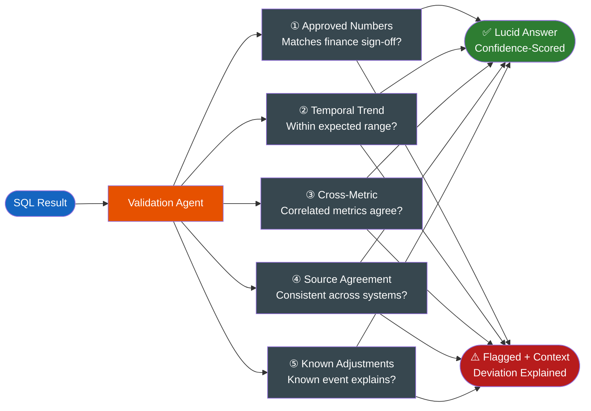
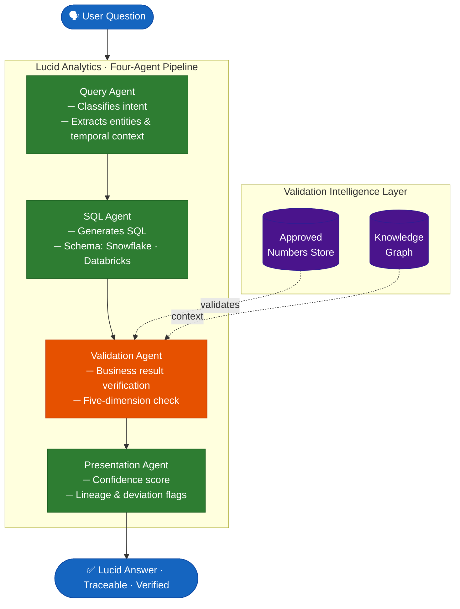

# Snowflake Has VQR. Databricks Has Trusted Answers. Neither is Enough.

*Text-to-SQL accuracy is largely solved. Business result correctness is not. Here's the architectural gap nobody's naming yet.*

---

My first week presenting analytics insights to a business team, I confidently announced: *"Revenue has increased exactly 2x since the new product launched — it's probably 2x better."* No hesitation, no caveat. I believed the number.

My lead pulled me aside after the meeting. The queries were duping. Revenue hadn't doubled. Somewhere upstream, the pipeline had introduced a row-level duplication — and the SQL had faithfully counted every transaction twice. Perfect SQL. Correct joins. Valid aggregation. Wrong answer.

What made it worse: nothing in the system flagged it. There was no crossed wire, no red banner, no prompt saying "this result looks unusual against prior periods." The data platform returned the number with full confidence because the question of *is this result business-correct* never occurred to it.

That was years ago. Today, as teams bet their analytics layer on LLMs, the same gap exists — only at much greater scale, with much higher stakes.

The real question was never "can the LLM write SQL?" — that problem is largely solved. The real question is: *can the system know whether the result makes business sense?* Snowflake and Databricks have built impressive answers to the first question. They've barely touched the second.

---

## What Snowflake and Databricks Have Actually Built

Let's be honest about the state of the art, because neither of these is a toy.

**Snowflake Cortex Analyst** is a multi-agent pipeline under the hood: a Question Understanding agent parses intent, a SQL Generation layer runs multiple LLM candidates, an Error Correction agent checks for compilation errors and missing references, and a Synthesizer assembles the final response. Layered on top is the **Verified Query Repository (VQR)** — a curated library of question-to-SQL mappings stored in your semantic model YAML, each stamped with `verified_by` and `verified_at` fields. When a question matches a VQR entry, the API response carries a `confidence` score. On text-to-SQL benchmarks, Cortex Analyst clears roughly 90% accuracy. That's genuinely impressive.

**Databricks Genie** takes a complementary approach. Trusted Answers are predefined functions and parameterized SQL templates curated by domain experts. Genie layers expert-written natural language instructions on top of Unity Catalog metadata, adds a thumbs-up/thumbs-down feedback loop to improve over time, and inherits full lineage from the catalog. Accuracy on structured benchmarks is similarly high.

Both platforms have invested seriously in turning English into correct SQL. The race to 90%+ accuracy on NL-to-SQL benchmarks is, for all practical purposes, over. Which makes the remaining problem more visible, not less.

---

## The Core Limitation: A Verified Query Is Not a Verified Result

Here's the thing about VQR that's worth sitting with: it's a library of approved *question-to-SQL mappings*. It is not a library of approved answers.

The semantic model YAML might contain `verified_by: "john.smith@company.com"` and `verified_at: "2025-11-14"`. John verified that this SQL correctly expresses the intent of the question at the time he reviewed it. What VQR cannot do is re-verify that the *result of running that SQL today* matches what the business would consider correct.

Genie Trusted Answers has the same characteristic. The templates produce consistent, expert-reviewed SQL. They do not validate that the number that SQL returns belongs in a board presentation.

Snowflake's Error Correction agent — which is a real architectural step and deserves credit for existing — checks SQL syntax and semantic validity. It will catch a reference to a table that doesn't exist, a broken join, a malformed aggregate. It will not catch that Revenue spiked 2x because the pipeline started double-counting rows.

Sound familiar?

The analogy is simple: a verified recipe doesn't guarantee the dish tastes right if the ingredients changed.

---

## Five Things Nobody Checks Today

This is where the gap becomes concrete. Here are five validation dimensions absent from every major text-to-SQL product on the market today:

| Validation Dimension | What It Checks | Why It Matters |
|---|---|---|
| **Approved Numbers** | Does this result match what the DW showed at close — the exact scope, grain, and adjustments Finance blessed? | The DW keeps moving after close. Late-arriving records, backfilled corrections, ERP write-offs that never touched the transactional tables. The LLM queries live data. Finance approved a moment in time. Those are two different numbers. |
| **Temporal Trend Consistency** | Is this value within expected range relative to prior periods? | A 2x revenue figure should be flagged before it reaches a meeting, not after. |
| **Cross-Metric Consistency** | Do correlated metrics agree directionally? | Revenue up 2x with customer count flat and no new markets opened is a red flag, not a result to silently return. |
| **Source Agreement** | Does the number match across source systems? | CRM says 1,200 customers. ERP says 1,150. The LLM picked one. You don't know which. |
| **Known Adjustments** | Was there an event (acquisition, write-off, pipeline change) that explains a deviation? | Without this context, a valid deviation looks like good news — until someone checks. |

Neither VQR nor Trusted Answers checks any of these. Both platforms stop at *"did we match a curated query template?"* — which is a meaningful step, but it's not the finish line.

The `confidence` field in Snowflake's API response is revealing here. A high confidence score means the system matched your question to a VQR entry with high certainty. It does not mean the returned number is correct in any of the five dimensions above. Confidence in template-matching is not the same thing as confidence in business correctness.

---

## The Medallion Moment: Naming the Gap

Here's what I've noticed: the data industry only solves problems it names.

Databricks didn't invent the idea of layering raw, refined, and enriched data. Staging layers existed before Bronze/Silver/Gold. What Medallion Architecture did was give the industry a shared frame — name the pattern, define the boundaries, give teams a common vocabulary. Once the frame existed, the behavior changed. Adoption accelerated not because the technical insight was new, but because the frame made it actionable.

We're at the same inflection point with AI analytics. The problem isn't SQL quality. The problem is *business result correctness* — and right now, nobody is naming it.

I'm naming it: **Lucid Analytics**.

*Analytics where every answer is clear, explainable, and agent-verified. You see how, why, and where every result comes from — not a black box, but a fully traceable reasoning chain.*

This is not a replacement for Snowflake or Databricks. Build on Cortex Analyst. Use Unity Catalog. Get to 90% accuracy on SQL generation — that work is done and it's real. Lucid Analytics is the validation layer that completes the picture by answering the question those platforms don't ask: *is this result right for the business?*

---

## The Architecture in Brief

A four-agent pipeline that sits on top of your existing data platform:

Two stores power the validation layer:

- **Approved Numbers Store**: A timestamped fingerprint of what the DW said at close — the exact scope, grain, and adjustments that Finance signed off on. Not a separate source of truth. Not static SQL templates. A snapshot of agreed-upon DW outputs at a known point in time. The DW keeps moving after close: late-arriving records land, pipelines backfill corrections, ERP adjustments apply at the reporting layer and never touch the transactional tables. The LLM queries live data and returns $4.4B. Finance approved $4.0B net on October 1st. The Validation Agent knows the difference and surfaces it before it reaches a slide deck. Critically: the store backfills from sources already in your stack — dbt snapshots, period-end summary tables, BI-certified datasets. No upstream schema changes. No migration. It blends into the existing architecture from day one.

- **Knowledge Graph**: Encodes relationships between metrics, entities, business rules, and known events. It's what lets the Validation Agent know that correlated metrics should move together — and that a 2x revenue spike with flat customer count and no new markets is a signal worth examining, not a result to celebrate uncritically.

Every answer is *lucid*: traceable, explainable, and confidence-scored.

---

## What This Means for Your Stack

Use VQR for what it's good at — fast, pre-approved SQL patterns for high-frequency questions. Use Genie's expert-curated instructions as a foundation. Layer Lucid Analytics on top to validate the *results* those systems return — not the queries, the results.

The pattern works with either platform because the problem it solves is upstream of the platform. It's about what you do with the result *after* accurate SQL has been generated.

---

## Where This Goes

What if results validated themselves before reaching the analyst? Not after someone gets pulled aside after a meeting. Not during a post-mortem. Before — as a systematic architectural guarantee, not a lesson learned the hard way.

That's Part 2: a deep dive into the Validation Agent implementation, the schema design for the Approved Numbers Store, and how the Knowledge Graph encodes business rules that LLMs can't infer from schema alone.

The reference architecture is open source.

**GitHub:** [https://github.com/sureshmondan/trusted-ai-analytics](https://github.com/sureshmondan/trusted-ai-analytics)

*Part 2: Building the Validation Agent — coming soon.*

---

*Have you shipped a number to stakeholders that turned out to be a pipeline artifact? Drop a comment — the more concrete the scenario, the better.*

---

**About the author**

Suresh Mondan is a Data Engineer building enterprise-scale unified data platforms. Currently designing a greenfield Snowflake architecture for a major bank — owning Architecture, Standards, and Enablement across Deposits, Loans, and beyond. Previously at Disney, where he owned mission-critical Snowflake warehouses across Finance, HR, and Content IP serving 15+ analytics teams at enterprise scale.
